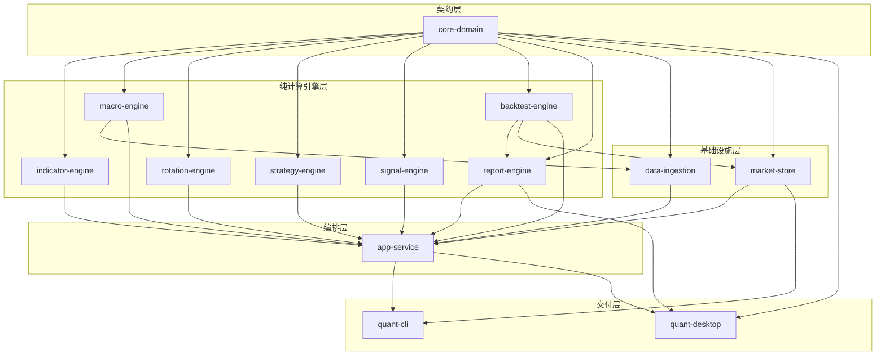
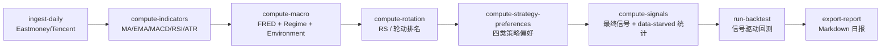
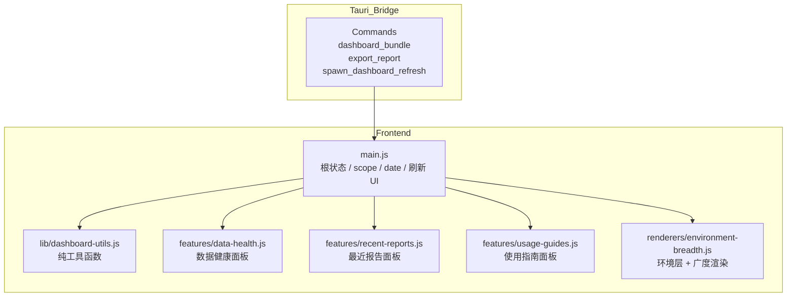

# Rust Quant Analysis System — 项目结构说明书

> 本文档是项目当前目录层级、功能划分与依赖关系的权威梳理。  
> 最后更新：2026-05-20  
> 对应 commit 阶段：默认 `export-report` fail-loud 修复与 Trading-Aware Partial Coverage 已落地。

---

## 1. 项目概览

**核心目标**：构建一套本地桌面量化研究系统 V1，面向低频、趋势、长线的指数 / ETF 研究场景，跑通从数据拉取到报告导出的完整链路。  
**技术栈**：Rust Workspace + Tauri v2 + Plain JS / Vite + ClickHouse + SQLite + Docker。

---

## 2. 顶层目录结构

```text
rust-quant-analysis-system/
├── apps/                          # 交付层：CLI + Desktop
│   ├── cli/                       # 命令行入口 (quant-cli)
│   └── desktop/                   # 桌面端 (Tauri + 前端)
│       ├── frontend/              # Vite + Plain JS 前端
│       │   ├── src/
│       │   │   ├── main.js
│       │   │   ├── styles.css
│       │   │   ├── lib/
│       │   │   │   └── dashboard-utils.js
│       │   │   ├── features/
│       │   │   │   ├── data-health.js
│       │   │   │   ├── recent-reports.js
│       │   │   │   └── usage-guides.js
│       │   │   └── renderers/
│       │   │       └── environment-breadth.js
│       │   ├── dist/              # 构建产物（Vite 输出）
│       │   └── node_modules/      # npm 依赖
│       └── src-tauri/             # Tauri Rust 桥接层 (quant-desktop)
│           ├── src/
│           │   ├── main.rs
│           │   └── lib.rs
│           ├── Cargo.toml
│           ├── tauri.conf.json
│           └── icons/
│
├── crates/                        # Rust Workspace 核心实现层
│   ├── core-domain/               # 共享契约（DTO / Enum）
│   ├── data-ingestion/            # 数据拉取与标准化
│   ├── indicator-engine/          # 技术指标计算
│   ├── macro-engine/              # 宏观因子与市场状态 (Regime)
│   ├── rotation-engine/           # 相对强弱与轮动排名
│   ├── strategy-engine/           # 四类策略偏好评分
│   ├── signal-engine/             # 最终信号生成
│   ├── backtest-engine/           # 信号驱动回测
│   ├── report-engine/             # Dashboard / Report 载荷塑造
│   ├── market-store/              # ClickHouse + SQLite 持久化
│   ├── app-service/               # 编排门面（最高耦合层）
│   └── task-runner/               # 占位工具 crate
│
├── config/                        # 运行时配置
│   ├── universe.json              # 标的池
│   └── calendars/
│       ├── cn_holidays.json       # CN 静态休市日历
│       └── hk_holidays.json       # HK 静态休市日历
│
├── docs/                          # 使用手册、架构文档、设计文档
├── infra/                         # Docker / ClickHouse 启动资源
│   └── docker/
│       └── docker-compose.yml
│
├── sql/                           # 初始化 DDL
│   ├── clickhouse/001_init.sql
│   └── sqlite/001_init.sql
│
├── data/                          # 本地轻状态（SQLite 等）
├── reports/                       # 导出报告（运行时产物）
├── memory/                        # 项目记忆系统（Agent 协作上下文）
│   ├── product.md
│   ├── tech.md
│   ├── structure.md
│   ├── glossary.md
│   ├── decisions.md
│   ├── context.md
│   └── history/
│
├── runtime/                       # Agent 运行规范
├── target/                        # Rust 构建产物
├── Cargo.toml                     # Workspace 根
└── README.md                      # 当前事实来源主入口
```

---

## 3. Workspace 成员详解

### 3.1 共享契约层

| Crate | 名称 | 职责 | 关键文件 | 依赖 |
|-------|------|------|----------|------|
| `core-domain` | 核心域 | 共享 DTO、枚举、序列化契约；所有下游 crate 的依赖根 | `src/lib.rs`（`AnalysisScope`, `Instrument`, `DailyBar`, `SignalSnapshot` 等）<br>`src/calendar.rs`（`TradingCalendar`） | `chrono`, `serde` |

> **约束**：保持 dependency-light，禁止引入 I/O 或 DB 映射。

### 3.2 纯计算引擎层（无 I/O，无持久化）

| Crate | 职责 | 关键文件 | 依赖 |
|-------|------|----------|------|
| `indicator-engine` | MA / EMA / MACD / RSI / ATR / VOL_MA 等技术指标 | `src/lib.rs` | `core-domain` |
| `macro-engine` | 宏观因子归一化、per-scope 市场状态 (Regime) 构建 | `src/lib.rs`（`build_macro_snapshots`, `build_market_regimes`） | `core-domain`, `chrono`, `serde` |
| `rotation-engine` | 相对强弱 (RS) 与轮动排名 | `src/lib.rs` | `core-domain`, `chrono`, `serde` |
| `strategy-engine` | 四类策略偏好评分 | `src/lib.rs` | `core-domain` |
| `signal-engine` | 最终信号标签生成；返回 `SignalBuildStats` 以暴露 data-starved 统计 | `src/lib.rs`（`build_signal_snapshots`） | `core-domain` |
| `backtest-engine` | 信号驱动回测模拟 | `src/lib.rs` | `core-domain`, `chrono`, `serde` |
| `report-engine` | Dashboard / Report 载荷塑造与 Markdown 渲染 | `src/lib.rs`（`DashboardSnapshot`, `render_markdown_report`） | `core-domain`, `backtest-engine`, `chrono`, `serde` |

> **约束**：纯计算 crate 禁止 fetch HTTP 或读写存储。

### 3.3 基础设施层

| Crate | 职责 | 关键文件 | 依赖 |
|-------|------|----------|------|
| `data-ingestion` | 外部数据拉取：Eastmoney / Tencent 日线、FRED 宏观；标准化与校验 | `src/lib.rs`（`fetch_daily_bars`, `fetch_fred_series`, `normalize_daily_bar`） | `core-domain`, `macro-engine`, `reqwest`, `serde`, `serde_json` |
| `market-store` | ClickHouse + SQLite 所有 IO；enum/string 桥接；日期门控 helper | `src/lib.rs`（`StorageConfig`, `insert_*`, `fetch_*`, `execute_clickhouse_query`） | `core-domain`, `backtest-engine`, `reqwest`, `rusqlite`, `serde`, `serde_json` |

> **约束**：
> - `market-store` 禁止吸收领域评分逻辑。
> - 当前 `src/lib.rs` 为 god-module，是最需要按 domain（`bars`, `signals`, `backtest`, `reports`）拆分的文件。

### 3.4 编排与交付层

| Crate / App | 职责 | 关键文件 | 依赖 |
|-------------|------|----------|------|
| `app-service` | 编排门面：刷新规划、Dashboard/Report 加载、Trust 组装、Pipeline 诊断、数据健康、阶段门控、最近报告元数据 | `src/lib.rs`（`AppContext`, `dashboard_bundle_with_scope`, `build_trust_summary`, `export_report_with_scope`） | 几乎所有其他 crate |
| `quant-cli` | 薄 clap 命令行封装，直接映射 `AppContext` | `src/main.rs` | `app-service`, `market-store`, `clap` |
| `quant-desktop` (src-tauri) | Tauri 命令注册、刷新协调器、阶段控制、安全文件打开 | `src/lib.rs`（`spawn_dashboard_refresh`, `open_report_artifact`） | `app-service`, `core-domain`, `market-store`, `report-engine`, `tauri` |

> **约束**：CLI / Tauri 保持薄封装，不拥有量化逻辑。`app-service/src/lib.rs` 当前为 ~795 行的 monolith。

### 3.5 占位

| Crate | 职责 | 状态 |
|-------|------|------|
| `task-runner` | 占位工具 crate | 目前无实际业务逻辑 |

---

## 4. 可视化依赖关系图

### 4.1 模块分层依赖图（Mermaid）



### 4.2 数据管线阶段图（Mermaid）



> **注意**：阶段必须按顺序执行，不可倒序或跳过。桌面端 `Refresh data` 默认一键跑完全链路。

### 4.3 前端目录与数据流图（Mermaid）



---

## 5. 前端目录结构（`apps/desktop/frontend/src/`）

```text
src/
├── main.js                          # 根状态、scope/date 流、刷新 UI、顶层渲染
├── styles.css                       # 全局样式
├── lib/
│   └── dashboard-utils.js           # 纯工具函数（formatting / normalization / markdown / tone）
├── features/
│   ├── data-health.js               # 数据健康缓存、加载、导出、渲染、按钮事件
│   ├── recent-reports.js            # 最近报告：Open snapshot / Open artifact / Copy path
│   └── usage-guides.js              # 使用指南加载、开关、渲染、事件绑定
└── renderers/
    └── environment-breadth.js       # Environment Layer + Watchlist Breadth 成对渲染器
```

> **演进状态**：`main.js` 已按“先纯工具层、后状态与视图层”的顺序渐进拆分。

---

## 6. 关键配置与数据文件

| 路径 | 用途 |
|------|------|
| `config/universe.json` | 标的池定义（symbol / name / provider IDs / market / category / enabled） |
| `config/calendars/cn_holidays.json` | CN 静态休市日历（2024-2027） |
| `config/calendars/hk_holidays.json` | HK 静态休市日历（2024-2027） |
| `data/app_state.db` | SQLite 本地轻状态（由 `market-store` 管理） |
| `reports/` | 导出产物目录（日报、数据健康报告等） |
| `sql/clickhouse/001_init.sql` | ClickHouse 表结构初始化 |
| `sql/sqlite/001_init.sql` | SQLite 表结构初始化 |

---

## 7. 当前已知热点与约束

### 7.1 架构热点

| 热点 | 说明 | 状态 |
|------|------|------|
| `app-service/src/lib.rs` | ~795 行 monolith，编排逻辑集中，review 和后续拆分困难 | 进行中 |
| `market-store/src/lib.rs` | god-module，所有 SQL / IO / 桥接逻辑集中在一处 | 待拆分 |
| 前端 `main.js` 拆分 | 已按 utils → guides → data-health → environment-breadth 顺序渐进拆分 | 进行中 |

### 7.2 产品级约束

- **静态 JSON 日历覆盖 2024-2027**，跨年后需人工维护或接入半自动化源。
- **TradingCalendar 当前仅覆盖 CN/HK**，若新增 US 等市场需扩展 `Market` 枚举和 JSON 配置。
- **默认 `export-report` 已改为 fail-loud**：若 latest gate 落后，默认导出直接失败，需显式传 `--date` 导出历史报告。
- **Signal guard 已统一**：`compute-signals` 与 refresh 末尾一致复用 scoped diagnostics alerts，覆盖 `GLOBAL / CN / HK` 三个 scope。

### 7.3 工程现实

- 无正式 CI workflow；验证手段为 `cargo check/test` + 实际 CLI / Desktop 流程。
- `target/`、`reports/`、`node_modules/`、`dist/` 为生成/运行时产物，非源码事实来源。

---

## 8. Agent 协作边界提示

| 修改目标 | 应先读取的最近一层 AGENTS.md |
|----------|------------------------------|
| 共享 DTO / Enum / `TradingCalendar` | `crates/core-domain/AGENTS.md` |
| 宏观评分 / Regime 计算 | `crates/macro-engine/AGENTS.md` |
| 新增 persistence / 查询 | `crates/market-store/AGENTS.md` |
| 新增 pipeline 阶段 / trust / dashboard | `crates/app-service/AGENTS.md` |
| CLI 命令 / 参数 | `apps/cli/AGENTS.md` |
| Tauri 命令 / 刷新协调 / 文件打开 | `apps/desktop/src-tauri/AGENTS.md` |
| 前端 feature slice / renderer | `apps/desktop/frontend/AGENTS.md` |
| 跨层决策 / 目录重组 | `memory/decisions.md` + `memory/structure.md` |

---

## 9. 变更记录

| 日期 | 变更内容 |
|------|----------|
| 2026-05-20 | 初始版本：整合当前 Workspace 成员、目录层级、依赖关系、数据管线、前端切片、已知热点与 Agent 边界。 |
