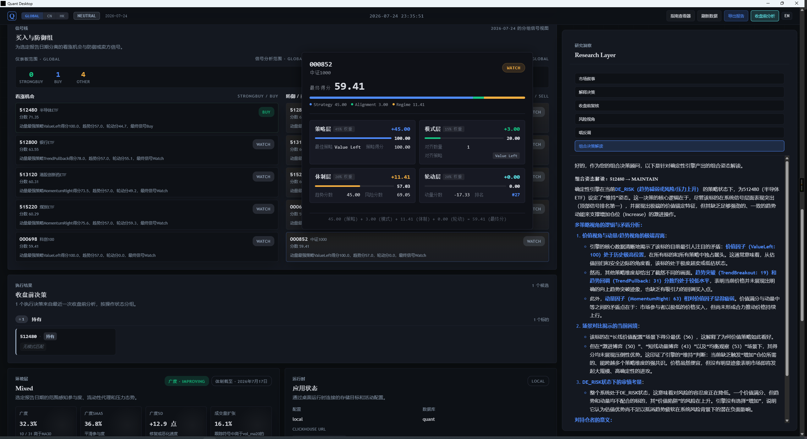

# Rust Quant Analysis System




## 使用手册

- `docs/日常操作手册.md`：适合每天快速更新、查看、导出结果
- `docs/分析使用手册.md`：适合趋势 / 长线分析时理解 MA20 / MA60 / MACD / regime / rotation / signal
- `docs/系统架构与数据流.md`：梳理系统整体架构、数据来源、数据流转路径与关键日期语义
- `docs/功能模块与处理逻辑.md`：梳理各模块职责、输入输出、数据来源与处理逻辑
- `docs/文档状态说明.md`：区分当前实现主参考、活跃设计、历史归档与运行产物
- `设计规划-rv1.md`：RV1 能力收敛设计规划
- 这些文档也已接入桌面端 UI，可通过 Dashboard 内的 **Help / Usage** 入口直接查看

本项目是一个 **Daily Portfolio Decision Assistant**（每日组合决策辅助系统），核心目标是：

- 用 Rust 构建完整研究链路
- 用 Tauri 提供桌面端界面
- 用 ClickHouse 保存分析型时序数据
- 面向 **低频、趋势、长线** 的指数 / ETF 研究场景
- 每日收盘后判断趋势健康度，决定加仓 / 持有 / 减仓 / 等待

当前已经跑通完整链路：

> 数据拉取 → 指标计算 → 宏观判断 → 轮动排序 → 策略偏好 → 最终信号 → 回测 → 报告 → 桌面展示

---

## 架构所有权（Architecture Ownership）

本项目采用分层所有权模型，每层只负责一种职责，禁止跨层泄漏：

```text
数据所有权（Data Ownership）
    ResearchDataset              ← app-service 内部，ephemeral，不暴露
    ResearchSnapshot             ← app-service 内部，computation workspace

语义所有权（Semantic Ownership）
    ResearchContext              ← 跨消费者共享的 canonical semantic contract

展示所有权（Presentation Ownership）
    ReportingSnapshot            ← 展示层 metadata + research context
    ReportInput                  ← 文档专属输入，document generation workflow 独占
    ReportBuilder                ← 文档组装（Research / Audit / Review）
    ReportDocument               ← 渲染前文档模型

渲染所有权（Rendering Ownership）
    Formatter                    ← Markdown / Text / JSON 渲染，无业务计算

消费者（Consumers）
    CLI / Desktop / API / GPT / Email / PDF
```

核心规则：
- `ResearchContext` ≠ 万能 DTO，不承载 consumer-specific 字段。
- `ReportInput` 只承载 document payload，不重复 metadata（scope/date/generated_at）。
- 所有可复用的研究计算位于 `core-domain::research`。
- `ResearchDataset` 永不暴露到 `app-service` 边界之外。

详细架构演进见 `docs/v6/adr-068-research-context-reporting-layer.md` 与 `memory/decisions.md`（ADR-068）；不可违反的分层规则见 `docs/architecture-invariants.md`（ADR-069）。

---

## 1. 当前能力概览

### 核心模块

- 日线行情拉取与入库（Eastmoney / Tencent / FRED）
- MA / EMA / MACD / RSI / ATR / VOL_MA
- 宏观因子、per-scope market regime 与 environment layer
- 相对强弱与轮动排名
- 四类策略偏好评分（ValueLeft / TrendPullback / TrendBreakout / MomentumRight）
- 最终信号生成
- 基础回测
- Markdown 报告导出
- Tauri 桌面 Dashboard（支持 `GLOBAL / CN / HK` scope）
- LLM 智能分析（OpenAI-compatible API）

### RV1 新增

- **多策略独立评分**：同一标的，四套策略各自给出独立评分和归因
- **组合操作建议**：Increase / Maintain / Reduce / Avoid（替代 BuyNow/Wait/NoChase）
- **Context Integrity Gate**：每次分析前检查数据完整性
- **Evidence Asset 状态查看**：`evidence-status` 查看 workspace 中的研究资产

### 当前适用场景

- 指数 / ETF 趋势研究
- 每日收盘后判断：加仓 / 持有 / 减仓 / 等待
- 长线 / 波段观察
- 重点看 `MA20 / MA60 / MACD`
- 用 LLM 做多视角市场解读

不适合作为：

- 高频执行系统
- 实盘自动交易系统
- 多用户在线量化平台

---

## 2. 技术栈

- **Rust**：核心实现
- **Tauri**：桌面端容器
- **ClickHouse**：分析型时序数据
- **SQLite**：本地轻状态
- **Vite + Vue 3**：桌面前端（Vue 3 + Composition API + vue-i18n）

---

## 3. 当前数据源策略

### 默认运行时数据源

- **CN 指数 / ETF**：Eastmoney 主源，Tencent 兜底
- **HK 指数**：Eastmoney / Tencent 低成本组合
- **宏观因子**：FRED（支持已持久化历史回退）

### 当前统一日线口径

- **Eastmoney：`fqt=1`** / **Tencent：`qfq`**
- **统一使用前复权 / qfq 日线序列**

---

## 4. 初始化与首次启动

### 4.1 启动 ClickHouse

```bash
docker compose -f infra/docker/docker-compose.yml up -d
```

### 4.2 初始化数据库

```bash
cargo run -p quant-cli -- init-storage
```

### 4.3 导入 universe

```bash
cargo run -p quant-cli -- seed-universe
```

---

## 5. 核心命令（RV1）

### 每日复盘命令（按执行顺序）

```bash
# 1. 全链路数据刷新（默认：刷新至今天、global、含回测）
cargo run -p quant-cli -- market-refresh
#   --to 2026-07-21         指定刷新截止日期
#   --scope cn|hk           latest-gate 诊断视角（不影响底层刷新范围）
#   --run-backtests false   跳过回测阶段，加速刷新

# 2. 每日分析（默认：global；30 秒看 Integrity + 信号 + 组合姿态）
cargo run -p quant-cli -- daily-analysis
#   --scope cn|hk           分析对应市场

# 3. 历史语境观测（默认：global；把今天放进历史：SRD 背离 / 市场拉伸 / 条件前向收益 / 数据健康，输出归档 markdown）
cargo run -p quant-cli -- research observe
#   --scope cn|hk                 观测对应市场
#   --date 2026-07-20             回看历史日期
#   --condition srd-strong        分析条件（默认 srd-strong）
#   --horizon 60                前向收益窗口（默认 20，可填任意交易日数）
#   --output <path>               自定义输出（默认 reports/research-observe-{scope}-{date}.md）
#   命中案例（标的当日 StrongBuy 信号 + scope 当日 DE_RISK 状态）自动写入/更新本地 divergence ledger（workspace/divergence-ledger/，gitignored）；该逐标的台账与 shadow-master.csv 日主台账并存

# 4. 多策略评分矩阵（默认：global、全标的、4 策略独立分 + 全部场景列）
cargo run -p quant-cli -- strategy-perspectives
#   --scope cn|hk                     只看对应市场
#   --scenario momentum_short         聚焦单场景列
#   --date 2026-07-20                 查看历史日期

# 5. 导出日报（默认：global、最新分析日期；需要留档时执行）
cargo run -p quant-cli -- daily-report
#   --scope cn|hk           导出对应市场日报
#   --date 2026-07-20       导出指定历史日期（跳过 gate 检查）
#   --concise               精简版日报

# 6. 持仓分析 (自动读 portfolio.toml，输出四段解读（真实暴露 / 映射可信度 / 市场×持仓张力 / 未知项）)
cargo run -p quant-cli -- llm-analyze --action portfolio_review --scope global

```

### 按需下钻（遇到张力 / 极端读数时）

```bash
# 单标的四策略归因（信号 StrongBuy 但姿态 Maintain/Avoid 等撕裂场景）
cargo run -p quant-cli -- strategy-perspectives --mode detail --symbol 512480
#   --scope cn|hk           对应市场
#   --date 2026-07-20       历史日期

# 组合姿态（盘中实时：Increase/Maintain/Reduce/Avoid）
cargo run -p quant-cli -- portfolio-decision
#   --scope cn|hk           分析对应市场候选标的

# 历史相似盘面（SRD 百分位极端或 Stretch=Extreme 时，查历史先例的后续走势）
cargo run -p quant-cli -- research analogues
#   --scope cn|hk           对应市场
#   --date 2026-07-20       目标日期（默认最新）
#   --top-n 5               返回前 N 个相似日
#   --lookback 252          历史搜索窗口（交易日）
#   --horizon 60            前向收益窗口（默认 20，可填任意交易日数）
```

### 周期命令（每周 / 双周 / 可脚本化）

```bash
# 每周：校准基线验证（默认：global、最近 60 个交易日窗口）
cargo run -p quant-cli -- validation-check
#   --scope cn|hk                     验证对应市场
#   --from 2026-04-01 --to 2026-07-21 指定窗口

# 双周/月度：信号回测（默认：global、初始资金 100 万、最多 3 只持仓）
cargo run -p quant-cli -- run-backtest
#   --scope cn|hk            回测对应市场
#   --use-state-sizing       启用状态感知仓位调整
#   --max-drawdown 0.15      最大回撤限制
#   --fee-rate / --slippage-rate / --max-holdings / --initial-capital

# 可脚本化：历史条件回放积累 Evidence（默认：global、最近 90 天、两种条件 × 20/60 日周期）
cargo run -p quant-cli -- historical-replay
#   --scope cn|hk           回放对应市场
#   --from / --to           指定回放窗口
#   --output-dir <path>     索引文件输出目录

# 随时：查看 Evidence 资产积累状态（P3 门控进度）
cargo run -p quant-cli -- evidence-status
```

### LLM 分析

```bash
# LLM 解读（默认：global、market_story；自动携带多策略评分 + 场景对比 + Integrity + 前次解读）
cargo run -p quant-cli -- llm-analyze
#   --scope cn|hk              分析对应市场
#   --action portfolio_review  组合决策解读（信号与姿态出现张力时推荐）
#   --action short_term_trader 短线交易员人格
#   --action long_term_allocator 长线配置者人格
#   --action risk_view         风险视角（风控总监）
#   --action explain_decision  解释决策（为什么系统这样决定）
#   --action devils_advocate   唱反调（质疑系统结论）
#   --action preclose_review   收盘前复核
#   --action market_adversarial_lens  市场博弈视角（资金角色/流动性/筹码/预期差）
#   --adversarial full|standard|compact|none  覆盖共享博弈背景注入级别（单次生效）
```

**共享博弈假设背景层（ADR-112，默认开启）**：

- 每次 LLM 分析前，系统确保当日"市场博弈假设背景"已生成（同一 scope 同一日期只算一次，落盘 `workspace/llm-history/{scope}/adversarial/`）
- 注入语义是**假设背景**而非结论：下游 persona 的职责是结合系统数据验证或反驳其中的假设
- 按 persona 分级注入：叙事/风控/组合类默认 `standard`（analysis_text 受 max_chars 保护，默认 4000 字符），`explain_decision` / `preclose_review` 默认 `compact`（摘要），`market_adversarial_lens` 自身不注入（递归防护）
- 每 scope 每日首次调用多一次 LLM 成本，后续调用零额外成本
- 配置：`config/llm.toml` 的 `[llm.adversarial]`（总开关 `auto_inject` + `[llm.adversarial.inject]` 分级映射）；CLI 用 `--adversarial` 单次覆盖

说明：

- `portfolio_review` 解读的是**确定性引擎**产出的组合姿态，LLM 只解释不决策（ADR-106）
- 自定义人格：在 `config/prompts.toml` 中添加 persona（仅视角指令，禁含阈值规则），`--action` 用 persona key 即可
- 每次分析自动保存到 `workspace/llm-history/`，下次分析自动携带前次解读（标注为非证据背景）

```bash
# 配置 LLM（只需执行一次）
cargo run -p quant-cli -- set-llm-config --base-url https://api.openai.com/v1 --model gpt-4o
cargo run -p quant-cli -- set-llm-api-key --key sk-xxxxxxxxxxxxxxxx
#   --timeout-secs 60        API 超时秒数
```

### 工程维护命令（help 中隐藏，仍可使用）

```bash
cargo run -p quant-cli -- research-srd --scope global         # SRD 单独查询（observe 已聚合）
cargo run -p quant-cli -- research-stretch --scope global     # Stretch 单独查询（observe 已聚合）
cargo run -p quant-cli -- research calibration --scope global # 校准（同 validation-check）
cargo run -p quant-cli -- research replay --scope global      # 历史回放（同 historical-replay）
cargo run -p quant-cli -- research consensus --scope global   # V7 研究综合
cargo run -p quant-cli -- research confirmation --scope global # V7 趋势确认
cargo run -p quant-cli -- research recovery --scope global    # V7 恢复指数
cargo run -p quant-cli -- research review --scope global      # 季度研究综述
cargo run -p quant-cli -- pipeline-dates                      # 管线各阶段日期与完整度
cargo run -p quant-cli -- explain-latest-gate                 # latest gate 未推进原因
cargo run -p quant-cli -- data-health                         # 数据健康检查 + 报告
cargo run -p quant-cli -- symbol-diagnostics --symbol 000300  # 单标的信号归因分解
cargo run -p quant-cli -- symbol-scoreboard --scope cn        # 全市场信号排行榜
cargo run -p quant-cli -- rotation-ranking --scope cn         # 轮动排名
cargo run -p quant-cli -- dashboard-snapshot --scope cn       # 历史 dashboard 快照
cargo run -p quant-cli -- dashboard-dates                     # 可选历史日期列表
cargo run -p quant-cli -- sync-and-export --scope global      # 旧版一键同步导出
```

分步管线命令（`ingest-daily` / `compute-macro` / `compute-indicators` / `compute-rotation` / `compute-strategy-preferences` / `compute-signals`）通常由 `market-refresh` 自动覆盖，仅在单阶段落后时精准修复使用；**必须按顺序执行**，否则 `daily-report` 会因 gate 落后被拒绝。

---

## 6. 桌面端启动方法

### 前端构建

```bash
cd apps/desktop/frontend
npm install
npm run build
```

### 桌面端运行

```bash
cargo build -p quant-desktop
cargo run -p quant-desktop
```

桌面端展示：Dashboard 总览、Scope 选择器、历史日期选择、Market Regime、Environment Layer、Trust Summary、Top Rotation、Top Signals、Latest Backtest、Data Health、Recent Reports、LLM 智能分析面板（7 个按钮：market_story / explain_decision / preclose_review / risk_view / devils_advocate / portfolio_review / market_adversarial_lens）。LLM 面板同时提供博弈背景注入级别选择器（full/standard/compact/none）与诊断信息条（diag strip）。顶栏「策略视角」按钮打开多策略人格卡片面板（四策略独立评分 + 场景对比 + 点击加载归因）。

---

## 7. 推荐使用流程

### 每日收盘后

1. `market-refresh` 拉取最新数据（成功后异步预生成当日博弈背景，ADR-113）
2. `daily-analysis` 30 秒看 Integrity 状态、信号、组合姿态
3. `research observe` 把今天放进历史语境（SRD 背离 / 拉伸 / 条件收益，归档 markdown）
4. `strategy-perspectives` 浏览全标的四策略 × 四场景矩阵
5. `llm-analyze --action portfolio_review --scope global` —— LLM 自动读 `config/portfolio.toml`（见 §8），输出"我的真实暴露 / 映射可信度 / 市场×持仓张力 / 未知项"四段解读；ADR-106 边界：只解释不决策
6. `daily-report` 需要留档时导出

**何时继续下钻：**

| 遇到的情况 | 下一步 |
|---|---|
| 信号 StrongBuy 但姿态 Maintain/Avoid | `strategy-perspectives --mode detail --symbol <标的>` 看四策略归因 |
| SRD 百分位极端 / Stretch=Extreme | `research analogues` 查历史相似盘面的后续走势 |
| 想做连续性趋势跟踪 | `llm-analyze --action market_story`（自动携带前次解读 + 默认注入博弈假设背景 ADR-112~114） |
| Strategy State 与实际持仓反复冲突 | 记录日期与现象——这是 TASK-093 divergence 积累 + Shadow Production 90 天观察期的输入 |

**周期动作：** 每周五 `validation-check`；双周/月度 `run-backtest`；Evidence 积累进度随时 `evidence-status`。Shadow Production 90 天到期后按 ADR-065 评估 State Layer 冻结是否解冻。

### 桌面端工作流

1. 打开桌面端 → 点击 `Refresh data`
2. 先看 `Trust summary` → 再下钻 `Pipeline freshness` 与 `Data health`
3. 确认后继续阅读 `Environment / Rotation / Signals / Backtest`
4. 需要 LLM 解读时切换到 LLM 分析面板——点 `portfolio_review` 按钮可自动结合你的持仓事实输出市场×持仓张力解读；其他 persona（`market_story` / `market_adversarial_lens` 等）按需选择
5. 需要留档时再导出 report

---

## 8. Portfolio Context（持仓事实层 P0）

`config/portfolio.toml` 是 RV1 合并后新增的**用户事实输入层**：记录你的基金/股票持仓（代码、名称、类型、系统底层映射、成本），但**不被任何 engine / signal / decision 路径消费**，仅作为每日复盘时"市场状态 × 我的持仓暴露"人工联动的背景。该文件已 gitignore，不会进入公开仓库；格式模板见 `config/portfolio.toml.example`。

### 三类映射的观察语义

| `mapping_quality` | 含义 | 日常观察使用方式 |
|---|---|---|
| `EXACT` | 系统分析的底层 instrument 与持仓基金真实跟踪标的等同 | Signal / Strategy / Rotation 可直接作为持仓的市场证据 |
| `PROXY` | 基金真实跟踪的指数不在系统 universe，用最近主题标的做代理 | 代理标的的 Signal 仅作"近似市场参考"，不等于基金本身——见 `portfolio.toml` 头部不变式 |
| `UNMAPPED` | 主动型基金无可靠底层映射；部分带 `proxy_symbol` 仅作风格参考 | 仅确认"你持有它"这一事实；不把主题代理标的的 Signal 直接赋予基金净值判断 |

### P0 边界

- **只存事实，不产指标**：`cost_basis` 是真实加权成本，但 P0 不计算盈亏/生命周期分/任何衍生指标
- **不接 engine**：没有任何 strategy / signal / execution 路径读取 PortfolioConfig
- **不建模时间**：`entry_date` 暂不要求——分批建仓方式下单点时间会制造伪精确；待未来 Lifecycle Observation 有证据支撑再设计
- **Next Gate**：Position Lifecycle Observation 等 Shadow Production 90 天 + TASK-093 divergence 实证数据齐备后再决定是否启动

### 修改持仓

复制 `config/portfolio.toml.example` 为 `config/portfolio.toml` 并填写你的持仓；改完跑 `cargo test -p core-domain` 会自动校验映射规则/唯一性/成本边界（8 个 portfolio 测试）。

---

## 附录. 已知限制

- 没有正式测试套件 / CI
- 桌面端 LLM 仅支持 OpenAI-compatible API，不支持流式输出
- 前端已支持多策略视角桌面端入口「策略视角」按钮（人格卡片 + 场景对比 + 点击加载归因）；多策略矩阵的 CLI 入口为 `strategy-perspectives`
- 桌面端 LLM 面板含 7 个 action 按钮（含 `portfolio_review`/`market_adversarial_lens`），共享博弈假设背景默认开启（ADR-112~114），注入级别四档可选（full/standard/compact/none）
- `config/portfolio.toml`（Portfolio Context P0）记录用户真实持仓事实，但 P0 阶段**不被任何 engine / signal / decision 路径消费**，仅供人工联动观察；Position Lifecycle 等更深的消费层待 Shadow Production + TASK-093 实证后决策
- Evidence 权重设计（P3）延迟，直到积累 1000+ 资产、30 天 Replay 稳定、2 周期 Calibration 稳定
