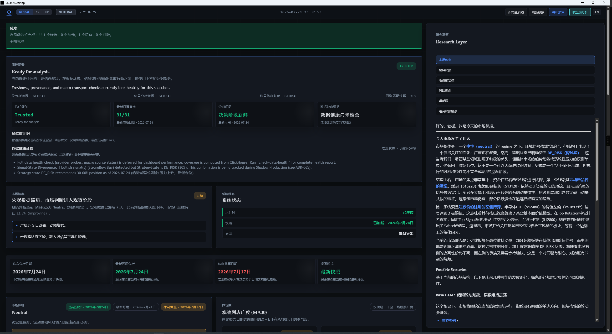

# Rust Quant Analysis System



## 使用手册

- `docs/日常操作手册.md`：适合每天快速更新、查看、导出结果
- `docs/分析使用手册.md`：适合趋势 / 长线分析时理解 MA20 / MA60 / MACD / regime / rotation / signal
- `docs/系统架构与数据流.md`：梳理系统整体架构、数据来源、数据流转路径与关键日期语义
- `shadow-production/historical-replay/historical-replay-report-2026-07-09.md`：Shadow Production 历史复盘测试报告（State Layer Regime Dependency / Model Bias 分析）
- `docs/功能模块与处理逻辑.md`：梳理各模块职责、输入输出、数据来源与处理逻辑
- `docs/v2/V2-Phase1-环境层详细技术设计.md`：V2 Phase 1（per-scope regime + environment layer）工程设计
- `docs/文档状态说明.md`：区分当前实现主参考、活跃设计、历史归档与运行产物
- `docs/阶段性更新.md#2026-04-26`：汇总阶段性成果与当前仍待继续推进的方向
- `docs/shadow-production-playbook.md`：V5 Shadow Production 90 天观察期操作指引
- 这些文档也已接入桌面端 UI，可通过 Dashboard 内的 **Help / Usage** 入口直接查看

本项目是一个 **本地桌面量化研究系统 V8**，核心目标是：

- 用 Rust 构建完整研究链路
- 用 Tauri 提供桌面端界面
- 用 ClickHouse 保存分析型时序数据
- 面向 **低频、趋势、长线** 的指数 / ETF 研究场景

当前已经跑通完整链路：

> 数据拉取 → 指标计算 → 宏观判断 → 轮动排序 → 策略偏好 → 最终信号 → 回测 → 报告 → 桌面展示

---

## 架构所有权（Architecture Ownership）

本项目采用分层所有权模型，每层只负责一种职责，禁止跨层泄漏：

```text
数据所有权（Data Ownership）
    ResearchDataset              ← app-service 内部，ephemeral，不暴露
    ResearchSnapshot             ← app-service 内部，computation workspace

语义所有权（Semantic Ownership）
    ResearchContext              ← 跨消费者共享的 canonical semantic contract

展示所有权（Presentation Ownership）
    ReportingSnapshot            ← 展示层 metadata + research context
    ReportInput                  ← 文档专属输入，document generation workflow 独占
    ReportBuilder                ← 文档组装（Research / Audit / Review）
    ReportDocument               ← 渲染前文档模型

渲染所有权（Rendering Ownership）
    Formatter                    ← Markdown / Text / JSON 渲染，无业务计算

消费者（Consumers）
    CLI / Desktop / API / GPT / Email / PDF
```

核心规则：
- `ResearchContext` ≠ 万能 DTO，不承载 consumer-specific 字段。
- `ReportInput` 只承载 document payload，不重复 metadata（scope/date/generated_at）。
- 所有可复用的研究计算位于 `core-domain::research`。
- `ResearchDataset` 永不暴露到 `app-service` 边界之外。

详细架构演进见 `docs/v6/adr-068-research-context-reporting-layer.md` 与 `memory/decisions.md`（ADR-068）；不可违反的分层规则见 `docs/architecture-invariants.md`（ADR-069）。

### 架构决策时间线

```text
V5  Engine-centric
      ↓
V6  Pipeline → Canonical Semantic Model → Stable Reporting Platform (Frozen)
      ↓
V7  Observation → Market Evolution → Historical Evidence → Research Synthesis (Frozen)
      ↓
V8  Durable Research Assets: computation → workspace → reproducible artifacts
```

V6 Reporting Platform 与 V7 Research Platform 均已冻结。新增消费者/能力应建立在两层平台之上，而不是继续调整平台本身。V8 开始将研究产物（Evidence、Snapshot、未来的 Knowledge/Validation/Hypothesis）以可复现、可审计、可版本化的 Research Asset 形式持久化到本地 workspace。

---

## 1. 当前能力概览

### 已实现模块

- 日线行情拉取与入库
- MA / EMA / MACD / RSI / ATR / VOL_MA
- 宏观因子、per-scope market regime 与 environment layer
- 相对强弱与轮动排名
- 四类策略偏好评分
- 最终信号生成
- 基础回测
- Markdown 报告导出
- Tauri 桌面 Dashboard（支持 `GLOBAL / CN / HK` scope）

- **V3**：一键同步导出（`sync-and-export`）
- **V3**：CLI 阶段进度输出（`--quiet` 关闭）
- **V3**：LLM 智能报告分析（OpenAI-compatible API）
- **V4.5**：Research Layer — 5 个按钮的只读叙事分析（Markdown 纯文本输出，无 Agent/无 Skill/无评分）
- **V5**：Execution Layer（Pattern Library）— 收盘前执行过滤（`preclose-analysis`）
- **V6**：Research Surface — `research-srd`（Signal-Regime Divergence 统计）、`research-stretch`（市场拉伸观测）与 `research review`（季度研究综述）
- **V7**：Market Evolution Semantic Layer + Historical Evidence Layer + Research Synthesis Layer
  - V7.1：`research confirmation` / `research recovery`（市场确认 / 恢复）
  - V7.2：`research analogues` / `research calibration`（历史相似匹配 / 校准框架）
  - V7.3：`research consensus`（研究综合：Bias / Confidence / Evidence）
  - V7.3.1：Research Platform 1.0 正式冻结（ADR-077）；`ConsensusConfig`、版本化 `ConsensusSummary`、`Calibration Baseline Version` 常量
  - V7.4：新增工作流命令 — `research observe`（聚合 SRD / Stretch / Analytics / Health）、`research replay`（历史 Evidence 重放）、`data-health`（合并检查 + 导出）
- **V8**：Durable Research Assets（可持久化研究资产）— Evidence / Snapshot 进入本地 workspace，统一身份 `RA-XXXXXX`、统一生命周期 `Draft → Verified → Published → Superseded → Archived`，通过 `research analytics --save-evidence` 与 Historical Replay 持续积累
  - V8.0：Evidence 直接由 `research explain` / `research analytics` / `research review` 产出
  - V8.1：Snapshot 引用 Evidence 而非嵌入（`EvidenceRef`）
  - V8.2：统一生命周期（ADR-080）与统一身份（ADR-081）
  - V8.3：P3（Evidence Score/Weight）延迟，直到积累 1000+ 资产、Replay 稳定 30 天、Calibration 稳定 2 周期

### 当前适用场景

14:45 自动触发执行过滤（`preclose-analysis`），基于实时行情数据判断「今天买不买」
- 指数 / ETF 趋势研究
- 低频交易辅助判断
- 长线 / 波段观察
- 重点看 `MA20 / MA60 / MACD`

不适合作为：

- 高频执行系统
- 实盘自动交易系统
- 多用户在线量化平台

---

## 2. 技术栈

- **Rust**：核心实现
- **Tauri**：桌面端容器
- **ClickHouse**：分析型时序数据
- **SQLite**：本地轻状态
- **Vite + Vue 3**：桌面前端（渐进式迁移中，Vue 3 + Composition API）

---

## 3. 当前数据源策略

### 默认运行时数据源

- **CN 指数 / ETF**：Eastmoney 主源，Tencent 兜底
- **HK 指数**：Eastmoney / Tencent 低成本组合
- **宏观因子**：FRED（运行时支持已持久化 `macro_snapshot` 历史回退）

### 暂不作为默认主源

- **Yahoo Finance**：当前环境已实测出现 `403`，因此不作为港股默认主源
- **Tushare**：保留为后续可选增强源，但当前 V6 不依赖它

### 当前统一日线口径

为了让 `MA20 / MA60 / MACD` 更稳定，当前 V6 已统一为：

- **Eastmoney：`fqt=1`**
- **Tencent：`qfq`**

也就是：

> **统一使用前复权 / qfq 日线序列**

---

## 4. Universe 配置

当前标的池文件：

- `config/universe.json`

当前字段：

- `symbol`：系统内部主标识
- `name`：中文名称
- `display_symbol`：展示符号
- `instrument_type`：`INDEX` / `ETF`
- `market`：`CN` / `HK`
- `category`：标的分类
- `eastmoney_secid`：Eastmoney 拉取标识
- `tencent_symbol`：Tencent 拉取标识
- `enabled`：是否启用

说明：

- `display_symbol` 是展示元数据
- `eastmoney_secid / tencent_symbol` 是抓数元数据
- 不要把展示符号和 provider 符号混用

---

## 5. 环境要求

建议环境：

- Windows
- Rust toolchain
- Node.js / npm
- Docker Desktop

需要确保：

- Docker 可以正常启动 ClickHouse
- 本机可访问 `127.0.0.1:18123`
- 能正常执行 `cargo` 和 `npm`

---

## 6. 项目结构

```text
rust-quant-analysis-system/
├── apps/
│   ├── cli/
│   └── desktop/
├── crates/
│   ├── app-service/
│   ├── backtest-engine/
│   ├── core-domain/
│   ├── data-ingestion/
│   ├── indicator-engine/
│   ├── macro-engine/
│   ├── market-store/
│   ├── report-engine/
│   ├── rotation-engine/
│   ├── signal-engine/
│   ├── strategy-engine/
│   └── workspace/                 (V8: Research Asset orchestration lives inside app-service)
├── config/
├── infra/
├── reports/                       (rendered reports)
├── workspace/                     (V8: durable Research Asset storage, gitignored)
│   ├── evidence/
│   ├── snapshots/
│   ├── registry/
│   │   ├── evidence-index.json
│   │   └── snapshot-index.json
│   └── README.md
└── sql/
```

> **注意**：`workspace/` 是 V8 新增的本地研究资产目录，默认不进入 git。它由 `app-service::workspace` 管理，CLI 通过 `--save-evidence` 或 Historical Replay 写入。

---

## 7. 初始化与首次启动

### 7.1 启动 ClickHouse

```bash
docker compose -f infra/docker/docker-compose.yml up -d
```

### 7.2 初始化数据库

```bash
cargo run -p quant-cli -- init-storage
```

### 7.3 导入 universe

```bash
cargo run -p quant-cli -- seed-universe
```

---

## 8. 数据管线（Data Pipeline）

> **默认推荐路径**：`sync-and-export`（一键检查 → 刷新 → 导出）。以下分步命令仅用于高级用户或排查场景。
>
> `--quiet` 是全局选项，放在子命令之前，可抑制 stderr 进度输出，仅保留 stdout JSON。

### 8.1 拉取日线数据

```bash
cargo run -p quant-cli -- ingest-daily --from 2026-05-19 --to 2026-05-20
```

### 8.2 计算宏观与市场环境

```bash
cargo run -p quant-cli -- compute-macro --from 2024-01-01 --to 2026-03-16
```

说明：

- `compute-macro` 会同时重建 `macro_snapshot / market_regime / environment_snapshot`
- 若部分 FRED 因子短时异常，系统会优先复用库里已有的 `macro_snapshot` 历史，继续按 as-of 语义构建 scoped regime / environment
- 若某次 provider 返回异常 HTML/非 CSV 响应，失败项会进入 `failed_items`，不再静默产出空结果

### 8.3 完整刷新（工程 / 高级用户路径）

```bash
cargo run -p quant-cli -- refresh-all
cargo run -p quant-cli -- refresh-all --to 2026-06-16
```

说明：

- 该命令会按当前 desktop refresh 相同顺序依次执行：
  - `ingest -> indicators -> macro -> rotation -> strategy -> signals -> backtests`
- `--scope` 用于选择**latest-date diagnostics / gate explanation** 的解释 scope，
  - 不表示只刷新某个 scope 的底层数据链路
- `--run-backtests` 当前默认为 `true`，与 desktop 完整 refresh 的语义一致
- 结束后会返回结构化 JSON，总结：
  - refresh window
  - latest daily date / latest gated dashboard date
  - refresh reason / repair window days
  - 各阶段执行结果
  - 各 scope 的 `pipeline_diagnostics`
  - default latest-date 是否推进
  - latest-gate / consistency 阻塞提示
- 当前 refresh window 不再只锚定 `latest_daily_date - 7d`；
  - 如果某个 scope 的 gated latest 落后，或仍没有 gated latest，
  - 系统会自动扩到一个保守的 repair window 来修复被 gate 卡住的较早日期
- 这条命令更适合作为 **显式工程路径 / 高级用户路径**；默认用户路径仍然优先推荐桌面端 `Refresh data`

### 8.4 一键同步导出（推荐默认路径）

```bash
cargo run -p quant-cli -- sync-and-export --scope global
cargo run -p quant-cli -- sync-and-export --scope cn --date 2026-05-07
```

说明：

- `sync-and-export` 是 V3 新增的**推荐默认路径**，一条命令完成：
  1. 检查 latest gate 状态
  2. 若 gate 落后，自动执行 `refresh_pipeline` 全链路刷新
  3. 刷新后再次检查 gate
  4. gate 通过后自动导出日报
- 不带 `--date` 时，自动处理最新日期；带 `--date` 时直接导出指定历史日期（跳过刷新）
- `--scope global|cn|hk` 选择对应的 dashboard scope
- `--run-backtests` 控制是否执行回测阶段，默认 `true`
- 若刷新后 gate 仍未通过，会 fail-loud 并提示运行 `explain-latest-gate` 排查

> 注：`compute-indicators`、`compute-rotation`、`compute-strategy-preferences`、`compute-signals` 也可单独执行，但通常由 `refresh-all` 或 `sync-and-export` 自动覆盖。单独执行适用于某个阶段 lagging 时的精准修复（例如 `strategy_preference` 已到最新，但 `signal_snapshot` 仍落后，可单独重跑 `compute-signals`）。

---

## 9. 检查与排查（Diagnostics）

```bash
# 检查各阶段最新日期与完整度
cargo run -p quant-cli -- pipeline-dates

# 解释 latest gate 为何未推进
cargo run -p quant-cli -- explain-latest-gate

# 数据健康检查（provider 可达性、缺口、异常波动、turnover 缺失）
cargo run -p quant-cli -- check-data-health
```

说明：

- `pipeline-dates` 返回每个 stage 的**最新日期**和**最新日是否全量完整**
- `explain-latest-gate` 专门解释：为什么默认最新日期还没有推进到 freshest market date，以及卡在 signal / rotation / regime / environment 哪一层
- `check-data-health` 偏向 provider 可达性、缺口、异常波动、turnover 缺失、宏观源状态
- 如果 `pipeline-dates` 显示某个 stage `is_latest=true` 但 `is_complete=false`，说明这一天**日期到了，但最新日样本不完整**

---

## 10. 桌面端启动方法

### 前端构建

```bash
cd apps/desktop/frontend
npm install
npm run build
```

### 桌面端运行

```bash
cargo build -p quant-desktop
```

调试运行：

```bash
cargo run -p quant-desktop
```

桌面端会展示：

- App status
- Scope selector（`GLOBAL / CN / HK`）
- Analysis date selector
- Market regime
- Environment layer
- Trust summary
- Top rotation
- Top signals
- Latest backtest
- Data health summary
- Recent reports（支持回跳 matching snapshot / open artifact / copy artifact path）
- Report export action
- **V4.5**：Research Layer — 5 个按钮的只读叙事分析（Markdown 纯文本输出，无 Agent/无 Skill/无评分）
- **V6**：Research Surface — `research-srd`、`research-stretch` 与 `research review` 只读观测命令（CLI）

---

## 11. 推荐使用流程（适合当前 V6/V7）

如果你当前主要做：

- 趋势判断
- 长线观察
- 低频操作
- 手动 / 低频刷新

当前默认用户路径建议是：

> **优先使用桌面端的 `Refresh data` 作为默认刷新入口；CLI 全链路命令继续保留为显式工程/高级用户路径。**

### 每日推荐 CLI 工作流（收盘后）

如果你选择 CLI，每天收盘后按这个顺序跑即可：

```bash
# 1. 检查 gate → 刷新全链路（如需）→ 导出市场日报
cargo run -p quant-cli -- sync-and-export --scope global

# 2. 数据健康检查 + 报告留档（V7 工作流）
cargo run -p quant-cli -- data-health

# 3. 每日研究观测（聚合 SRD / Stretch / Analytics / Health，V7 工作流）
cargo run -p quant-cli -- research observe --scope global

# 4. 收盘前执行过滤（V5 Execution Layer / Pattern Library）
cargo run -p quant-cli -- preclose-analysis --scope global
```

说明：

- `sync-and-export` 是 V3 推荐默认路径：一键完成 gate 检查、全链路刷新、导出日报。
- `data-health` 合并了 `check-data-health` 与 `export-data-health-report`，一次调用同时输出终端 JSON 摘要和 Markdown 报告。
- `research observe` 聚合 `research-srd` + `research-stretch` + `research analytics` + `check-data-health`，输出到 `reports/research-observe-global-{date}.md`。
- `preclose-analysis` 只回答「今天买不买」，不回答「买什么」；在 `signal ≥ Buy` 且 `state ≠ NO_TRADE` 的候选上运行 Pattern Library 过滤。
- 所有底层命令（`check-data-health`、`export-data-health-report`、`research-srd`、`research-stretch` 等）均保留不变。

如果你日常主要使用桌面端，更推荐的实际顺序是：

1. 打开桌面端
2. 点击 `Refresh data`
3. 先看 `Trust summary`
4. 再下钻 `Pipeline freshness` 与 `Data health`
5. 确认后继续阅读 `Environment / Rotation / Signals / Backtest`
6. 需要留档时再导出 report

### 高级参考：CLI 手动分步执行（工程路径）

> **这组命令必须按顺序执行**，不能倒序或跳过中间阶段，否则 `export-report` 会因 latest gate 落后而被拒绝。

```bash
# 1. 拉取行情
cargo run -p quant-cli -- ingest-daily --from 2026-06-01 --to 2026-06-05

# 2. 计算技术指标
cargo run -p quant-cli -- compute-indicators

# 3. 计算宏观与市场环境（同时重建 macro / regime / environment / strategy_state）
cargo run -p quant-cli -- compute-macro --from 2026-06-01 --to 2026-06-05

# 4. 计算轮动强弱
cargo run -p quant-cli -- compute-rotation

# 5. 计算策略偏好
cargo run -p quant-cli -- compute-strategy-preferences

# 6. 生成最终信号
cargo run -p quant-cli -- compute-signals

# 7. 检查各阶段日期是否推进
cargo run -p quant-cli -- pipeline-dates

# 8. 数据健康检查（检查 + 导出报告，V7 工作流）
cargo run -p quant-cli -- data-health

# 9. 查看 dashboard
cargo run -p quant-cli -- dashboard-snapshot

# 10. 导出日报（若前面有阶段 lagging，会 fail-loud）
cargo run -p quant-cli -- export-report

# 11. 每日研究速览（V7 工作流）
cargo run -p quant-cli -- research observe --scope global
```

补充说明：

- `pipeline-dates` 用来检查每个 stage 的**最新日期**和**最新日是否全量完整**
- 如果 `strategy_preference` 已到最新，但 `signal_snapshot` 仍落后，优先单独重跑一次 `compute-signals`
- `data-health` 合并了 `check-data-health` 与 `export-data-health-report`，一次调用同时输出终端 JSON 摘要与 Markdown 报告
- 如需单独检查（不导出报告），仍可运行 `check-data-health`；如需单独导出报告，仍可运行 `export-data-health-report`
- 如果 `pipeline-dates` 显示某个 stage `is_latest=true` 但 `is_complete=false`，说明这一天**日期到了，但最新日样本不完整**
- 如果 `report_date` 是最新日期，但 `regime_as_of_date` 更早，这通常表示**宏观因子按最近可用值 forward-fill**，不代表 dashboard 出错
- `GLOBAL / CN / HK` 的 dashboard/report/strategy/signal/backtest 现在各自读取对应 scope 的 regime 与 environment，不再复用 global regime 假装本地化；signal 和 backtest 均携带显式 provenance 字段（`analysis_scope`、`regime_basis_scope`、`matches current snapshot`）
- **默认 `export-report` 现在会在 latest gate 落后时直接失败，不再静默导出旧日期日报；如果确实要导出历史日报，请显式传 `--date YYYY-MM-DD`**

---

## 12. 查看与导出（Dashboard & Report）

```bash
# 查看可选历史日期列表
cargo run -p quant-cli -- dashboard-dates [--scope <scope>]

# 查看当前/历史 dashboard 快照
cargo run -p quant-cli -- dashboard-snapshot [--scope <scope>] [--date <date>]

# 导出日报
cargo run -p quant-cli -- export-report [--scope <scope>] [--date <date>]

# 导出数据健康报告
cargo run -p quant-cli -- export-data-health-report

# 数据健康检查 + 报告留档（V7 工作流）
cargo run -p quant-cli -- data-health

# 每日研究观测报告（V7 工作流）
cargo run -p quant-cli -- research observe --scope global|cn|hk [--date YYYY-MM-DD]
```

说明：

- `dashboard-snapshot` 不带参数时，默认返回**最新可分析日期**
- `dashboard-dates` 返回当前可选的历史分析日期列表
- `dashboard-snapshot --date YYYY-MM-DD` 可回看某一历史日期的分析结果
- `--scope global|cn|hk` 可切到对应 scope 的 dashboard 语义
- `dashboard-snapshot` 现在会返回 scope 对应的 `market_regime + environment`
- `dashboard-snapshot` 还会返回 `trust_summary`，用于汇总 freshness / data-health / provenance 的可用性判断
- `data-health` 同时输出终端 JSON 摘要与 Markdown 报告，合并原 `check-data-health` 与 `export-data-health-report`
- `research observe` 输出聚合了 SRD / Stretch / Analytics / Health 的 Markdown 日报，供每日研究速览
- signal / backtest 当前应结合显式 provenance（例如 `analysis_scope`、`regime_basis_scope`、`matches current snapshot`）一起阅读，而不是只按当前 dashboard scope 直觉推断
- `export-report` 不带参数时，默认导出当前最新分析日期的日报
- `export-report --date YYYY-MM-DD` 可导出指定历史日期的日报
- `export-report --scope ...` 会导出对应 scope 的日报
- **默认 `export-report` 现在会在 latest gate 落后时直接失败，不再静默导出旧日期日报；如果确实要导出历史日报，请显式传 `--date YYYY-MM-DD`**

---

## 13. LLM 智能分析

```bash
# 配置 LLM（只需执行一次）
cargo run -p quant-cli -- set-llm-config --base-url https://api.openai.com/v1 --model gpt-4o

# 设置 API Key（存储在系统 keyring，安全优先）
cargo run -p quant-cli -- set-llm-api-key --key sk-xxxxxxxxxxxxxxxx

# 分析当前最新日报
cargo run -p quant-cli -- analyze-with-llm --scope global
```

说明：

- 仅支持 OpenAI-compatible API（自定义 `base_url + model + api_key`）
- API Key 优先存储在 OS keyring，失败时回退到 SQLite credential_store（会打印警告）
- 分析结果保存为 `reports/llm-analysis-{scope}-{date}.md`
- 分析文本不会出现在 stdout/stderr/logs/JSON 中，仅保存在报告文件内
- 不支持流式输出、多 provider、prompt 模板、RAG 或 embeddings

### V4.5 桌面端 LLM 命令（Tauri 内部调用，也可手动调试）

```bash
cargo run -p quant-desktop -- get-llm-status
cargo run -p quant-desktop -- analyze-with-llm --scope global --action market_story
cargo run -p quant-desktop -- analyze-with-llm --scope cn --action explain_decision
cargo run -p quant-desktop -- analyze-with-llm --scope hk --action risk_view
```

可用的 `action` 参数：
- `market_story` — 市场叙事（今天发生了什么）
- `explain_decision` — 解释决策（为什么系统这样决定）
- `preclose_review` — 收盘前复核（Execution 建议解读）
- `risk_view` — 风险视角（风控总监视角）
- `devils_advocate` — 唱反调（质疑系统结论）

**注意**：V4.5 已删除 Agent Profile、Skill Registry、技能路由、比较分析、历史记录。只保留 5 个按钮的纯 Markdown 输出。

---

## 14. 回测（Backtest）

```bash
cargo run -p quant-cli -- run-backtest
cargo run -p quant-cli -- run-backtest --scope global --use-state-sizing --max-drawdown 0.15
```

参数说明：

- `--scope <scope>`：选择回测 scope（`global|cn|hk`）
- `--use-state-sizing`：启用状态感知仓位调整
- `--max-drawdown <ratio>`：最大回撤限制（如 `0.15` 表示 15%）
- `--initial-capital <amount>`：初始资金（默认系统内置）
- `--max-holdings <n>`：最大持仓数
- `--fee-rate <ratio>`：交易费率
- `--slippage-rate <ratio>`：滑点率

---

## 15. 诊断与调试（Research & Debug）

> **以下命令为研究/实验用途，输出格式可能随版本变更，不保证向后兼容。**

### 15.1 系统状态快速检查

```bash
cargo run -p quant-cli -- status
```

返回当前系统状态摘要（JSON），包括最新数据日期、各阶段推进情况、gate 状态等。

### 15.2 真值审计与标签生成（Ground Truth）

通用参数：`--from <date> --to <date> [--scope <scope>]`

| 命令 | 说明 |
|------|------|
| `validate-regime-accuracy` | 验证 regime 标签与历史走势的匹配度 |
| `inspect-ground-truth` | 查看已生成的 Ground Truth 标签 |
| `generate-regime-labels` | 基于规则生成 regime 标签（用于校准） |
| `audit-gt-regime` | 审计 regime 标签质量 |
| `audit-gt-transitions` | 审计 regime 切换频率与稳定性 |
| `audit-gt-candidates` | 查看候选 regime 切换点 |
| `validate-gt-regimes` | 验证 Ground Truth regime 一致性 |
| `generate-ground-truth-labels` | 生成 Ground Truth 标签集 |
| `audit-ground-truth` | 综合 Ground Truth 审计 |

### 15.3 观察层与归因审计（Observation & Attribution）

通用参数：`--from <date> --to <date> [--scope <scope>]`

| 命令 | 说明 |
|------|------|
| `audit-observation-layer` | 审计市场观察层数据质量 |
| `audit-attribution` | 归因分析：各因子对 regime 的贡献度 |
| `replay-trend-sensitivity` | 趋势敏感度重放分析 |
| `gt-sensitivity-replay` | Ground Truth 敏感度重放 |
| `audit-lead-lag` | 领先/滞后关系审计 |

### 15.4 状态与信号分解（State & Signal Decomposition）

通用参数：`--from <date> --to <date> [--scope <scope>]`

| 命令 | 说明 |
|------|------|
| `audit-state-signal-decomposition` | 状态-信号分解审计 |
| `audit-state-transitions` | 状态切换路径审计 |
| `audit-persistence-sensitivity` | 持久性敏感度分析 |
| `audit-market-structure` | 市场结构审计 |
| `audit-false-positive-breakdown` | 假阳性拆解分析 |

### 15.5 经济与配置原型（Economic & Allocation Prototype）

通用参数：`--from <date> --to <date> [--scope <scope>]`

| 命令 | 说明 |
|------|------|
| `audit-economic-replay` | 经济情景重放 |
| `audit-economic-attribution` | 经济因子归因 |
| `audit-allocation-prototype` | 配置策略原型测试 |
| `audit-counterfactual-regime` | 反事实 regime 分析 |
| `audit-economic-regime-prototype` | 经济 regime 原型 |

### 15.6 前沿与机制实验（Frontier & Mechanics）

通用参数：`--from <date> --to <date> [--scope <scope>]`

| 命令 | 说明 |
|------|------|
| `audit-pareto-frontier` | Pareto 前沿分析 |
| `audit-persistence-frontier` | 持久性前沿分析 |
| `audit-persistence-mechanics` | 持久性机制审计 |
| `audit-dual-layer-validation` | 双层验证审计 |
| `audit-state-persistence-economics` | 状态持久性经济学分析 |

### 15.7 符号诊断与排行榜（Symbol Diagnostics）

```bash
# 单标的诊断
cargo run -p quant-cli -- symbol-diagnostics --symbol <symbol> [--date <date>] [--scope <scope>]

# 全市场标的排行榜
cargo run -p quant-cli -- symbol-scoreboard [--date <date>] [--scope <scope>]

# 轮动排名
cargo run -p quant-cli -- rotation-ranking [--date <date>] [--scope <scope>]
```

### 15.8 Research Surface 观测工具（V6）

> **V6 新增**：只读研究层工具，用于把市场状态量化为可长期积累的统计证据。不修改任何信号/状态/执行/风控逻辑。
>
> 它们不是买卖建议，而是回答"市场现在发生了什么"。

```bash
# Signal-Regime Divergence 统计（使用最新可用日期）
cargo run -p quant-cli -- research-srd [--scope global|cn|hk]

# Market Stretch / 市场拉伸分析（使用最新可用日期）
cargo run -p quant-cli -- research-stretch [--scope global|cn|hk]

# 条件前向收益统计
cargo run -p quant-cli -- research analytics --condition srd-strong|stretch-extreme-crowding-momentum [--scope global|cn|hk] [--horizon 20|60]

# 条件前向收益统计 + 保存为可复现 Research Asset（V8）
cargo run -p quant-cli -- research analytics --condition srd-strong --scope global --horizon 20 --save-evidence

# 季度研究综述：聚合 SRD / Stretch / Analytics 为 Markdown 报告
cargo run -p quant-cli -- research review [--scope global|cn|hk] [--from YYYY-MM-DD] [--to YYYY-MM-DD] [--output path.md]
```

说明：
- `research-srd` 量化"Signal 很强但 State 保守"的背离持续情况，输出 Duration、StrongBuy 数、Average Signal、Breadth trend、Rotation pattern、Historical percentile。
- `research-stretch` 从 Crowding、Breadth、Momentum、Leverage 四个维度描述市场拉伸程度，每个维度附带 Evidence。
- `research analytics` 计算特定历史条件出现后的前向收益分布（median / mean / best / worst / positive ratio / median max drawdown），仅用于积累统计证据。
- `research review` 把观察窗口内的 SRD 分布、Stretch 等级分布、以及条件前向收益统计汇总成一份 Markdown 报告，输出到 `reports/research-quarterly-{scope}-{to}.md`，仅用于积累证据和后续 ADR Review。
- 建议每日收盘后工作流：`research-srd` → `research-stretch` → `analyze-with-llm --action market_story`；季度末运行 `research review`。

**指标解读（以实际输出为例）**：

`research-srd --scope global` 示例：
```text
StrongBuy count:       3
Buy count:             4
Average Signal:        50.2
Duration:              3 days
Breadth trend:         Weakening
Rotation pattern:      Technology Dominant
Historical percentile: 22% (Low)
Interpretation:        Signals are strong while Strategy remains LeftProbe ...
Confidence:            Moderate
```
- **StrongBuy / Buy count**：当天产生 StrongBuy / Buy 信号的标的数量。数量多说明表层信号偏强。
- **Average Signal**：所有信号标的的平均最终得分，反映整体信号强度。
- **Duration**：当前 SRD 状态连续持续的交易天数。持续天数越长，说明"信号强但状态保守"的背离越顽固。
- **Breadth trend**：广度走势（Improving / Weakening / Stable）。Weakening 表示参与上涨的标的比例在下降，可能预示背离。
- **Rotation pattern**：当前轮动特征（如 Technology Dominant）。用于判断强势是否集中在少数主题。
- **Historical percentile**：当前 SRD 强度在过去历史中的百分位。22% 表示当前处于历史较低水平，背离不算极端。
- **Interpretation / Confidence**：系统给出的定性解读和置信度，仅作参考，不进入决策。

`research-stretch --scope cn` 示例：
```text
Overall:               Extreme
Crowding:              Extreme (Top5 Rotation = 118.2%, Historical Percentile = 68%)
Breadth:               Elevated (Breadth = 29.2%, SMA5 = 42.5%)
Momentum:              Elevated (RS120 Max = 73.7, RS120 Top5 Avg = 43.8)
Leverage:              Normal (data pending)
Risk Level:            Moderate-High
```
- **Overall**：综合拉伸等级（Normal / Elevated / Extreme）。Extreme 表示多个维度同时出现极端读数。
- **Crowding**：拥挤度。Top5 Rotation 占比越高，说明资金越集中在少数领涨方向；Historical Percentile 表示该拥挤度在历史中的位置。
- **Breadth**：市场广度。Breadth 为当前日标的站在均线之上的比例；SMA5 为 5 日平滑，用于判断短期趋势。
- **Momentum**：动量。RS120 Max 是 120 日相对强度最大值，Top5 Avg 是前 5 名平均，用于识别动量是否过热。
- **Leverage**：杠杆维度（当前数据源 pending， Normal 为占位）。
- **Risk Level**：综合风险等级，不等于交易信号，只提示需要留意的市场状态。

`research analytics --condition srd-strong --scope global --horizon 20` 示例：
```text
Occurrences:              212
Forward return median:    +0.2%
Forward return mean:      +0.1%
Forward return best:      +9.8%
Forward return worst:     -9.0%
Positive ratio:           51.9%
Median max drawdown:      4.0%
```
- **Occurrences**：历史样本中满足 `srd-strong` 条件的天数。
- **Forward return median / mean**：条件发生后 N 个交易日的前向收益中位数 / 均值。正值不代表未来一定涨，仅说明历史统计倾向。
- **Best / Worst**：历史最好 / 最坏情况，用于评估尾部风险。
- **Positive ratio**：历史正收益样本占比。51.9% 接近随机，说明该条件单独不具备显著预测力。
- **Median max drawdown**：持有 N 个交易日的中位数最大回撤，衡量条件触发后的典型风险。

`research review` 会把以上三类指标按季度窗口聚合，输出到 `reports/research-quarterly-{scope}-{to}.md`，适合季度末做 ADR Review。

### 15.8 V7：Market Evolution + Historical Evidence + Research Synthesis Layer

> **V7 新增**：在 V6 Observation 基础上扩展为四层研究平台：Observation → Market Evolution → Historical Evidence → Research Synthesis。
>
> 已冻结为 Research Platform 1.0（ADR-077）。新增消费者/内容只能通过现有层消费，不修改语义架构。

```bash
# V7.1 Market Evolution（市场演化层）
# 判断市场趋势是否被广度、参与度和风险维度确认
cargo run -p quant-cli -- research confirmation --scope global|cn|hk [--date YYYY-MM-DD]

# 衡量市场从压力中恢复的程度
cargo run -p quant-cli -- research recovery --scope global|cn|hk [--date YYYY-MM-DD]

# V7.2 Historical Evidence（历史证据层）
# 基于 Market Fingerprint 检索历史相似市场状态
cargo run -p quant-cli -- research analogues --scope global|cn|hk [--date YYYY-MM-DD] [--top-n 5] [--lookback 252]

# 连续运行 Confirmation / Recovery / Analogues，输出校准报告
cargo run -p quant-cli -- research calibration --scope global|cn|hk [--from YYYY-MM-DD] [--to YYYY-MM-DD]

# V7.3 Research Synthesis（研究综合层）
# 综合 Observation / Evolution / Historical Evidence 输出研究语言解释
cargo run -p quant-cli -- research consensus --scope global|cn|hk [--date YYYY-MM-DD] [--horizon 20] [--top-n 5] [--lookback 252]

# V7 Workflow — 工作流命令（建立在 V7 平台之上，不修改平台语义）
# 一键聚合 SRD + Stretch + Analytics + Health 为单份日报
cargo run -p quant-cli -- research observe --scope global|cn|hk [--date YYYY-MM-DD] [--condition <name>] [--horizon 20|60] [--output path.md]

# 批量重放条件 × 周期，保存 Evidence 并输出 replay 索引
cargo run -p quant-cli -- research replay --scope global|cn|hk [--from YYYY-MM-DD] [--to YYYY-MM-DD] [--output-dir path]

# 数据健康检查 + 报告留档，合并原 check-data-health 和 export-data-health-report
cargo run -p quant-cli -- data-health
```

**说明**：
- `research confirmation` 输出确认等级（Strong / Moderate / Weak / None）及三维度得分（Trend / Participation / Risk）。
- `research recovery` 输出恢复指数（0-100）及驱动因素（如 Breadth improving / Volatility shrinking）。
- `research analogues` 输出历史相似匹配、距离等级（Very High / High / Moderate / Weak）及 Outcome Profile（前向收益统计）。
- `research calibration` 输出 `reports/research-calibration-{scope}-{start}-{end}.md`，包含 Evidence 分布、距离直方图、Calibration Baseline Version。
- `research consensus` 输出 `reports/research-consensus-{scope}-{date}.md`，包含 Bias、Confidence、Supporting/Contradicting Evidence、Summary。不输出买卖建议。
- `research observe` 输出 `reports/research-observe-{scope}-{date}.md`，聚合 `research-srd` + `research-stretch` + `research analytics`（默认条件 `srd-strong`、默认周期 `20`）+ `check-data-health`，供每日研究速览。可通过 `--condition` 与 `--horizon` 自定义分析条件。
- `research replay` 输出 `workspace/evidence/replay/RA-XXXXXX/body.json` 与 `shadow-production/historical-replay/` 索引文件，替代 PowerShell 历史复盘脚本。
- `data-health` 同时输出终端 JSON 摘要与 `reports/data-health-*.md` 留档报告，合并原 `check-data-health` 与 `export-data-health-report`。
- 以上工作流命令保留原有底层命令（`research-srd`、`research-stretch`、`research analytics`、`check-data-health`、`export-data-health-report`）不变。

**输出示例**（`research consensus --scope global`）：
```text
Research Consensus
  Bias:                  Constructive
  Confidence:            Medium
  Aggregate score:       0.34

Supporting Evidence:
  - Recovery (+0.12): Recovery improving
  - Analogues (+0.10): Historical analogues constructive
  - Signal (+0.10): Signal moderately constructive
  - Confirmation (+0.09): Confirmation moderate

Contradicting Evidence:
  - Stretch (-0.07): Stretch elevated

Summary:
  Research view is Constructive with Medium confidence. ...
```

**历史复盘与 Shadow Production**：
- 详见 [`shadow-production/historical-replay/historical-replay-report-2026-07-09.md`](shadow-production/historical-replay/historical-replay-report-2026-07-09.md)
- 核心发现：SRD-strong 全历史接近随机（Global H20 positive ratio 51.9%），但存在明显 **Regime Dependency**：2025 H2 出现 StrongBuy + DeRisk + 84.6% 正前向收益，而 2023 Q2 / 2024 H1 全部负收益。
- 这证明 State Layer v1.0 不是"对"或"错"，而是在特定市场阶段（高动量 / 低波动 / 主题扩散）存在 **Systematic Bias / Model Bias**。
- 下一步方向：建立 **Failure Attribution / Regime Attribution** 层，解释 Signal 在不同 Regime 下表现不同的原因。

### 15.9 收盘前执行过滤（Execution Layer — V5）

> **V5 新增**：基于实时行情数据的 Pattern Library 执行过滤器，不修改任何信号/状态/回测逻辑。
>
> 只回答 "When to buy"，不回答 "What to buy"。

```bash
# 收盘前分析（默认 global）
cargo run -p quant-cli -- preclose-analysis

# 指定 scope
cargo run -p quant-cli -- preclose-analysis --scope cn
cargo run -p quant-cli -- preclose-analysis --scope hk
```

**输出示例**：

```text
Scope: CN
Date: 2026-06-22
Candidates: 8 (filtered: signal≥Buy ∩ state≠NO_TRADE)

Symbol       Signal       State        Reasons
------------------------------------------------------------
512480       -            BUY_NOW      StrongClose, HighVolume
510300       -            NO_CHASE     GapUpOverextended, VolumeSpike, FarFromMA5
000688       -            WAIT         (no pattern match)
```

**说明**：

- 只分析 `signal ≥ Buy` 且 `state ≠ NO_TRADE` 的候选
- 实时数据来自 Tencent API（`qt.gtimg.cn`），失败时全部降级为 `Skip`
- 输出同时写入 `reports/execution-samples/YYYY-MM-DD.json`
- 90 天内仅作为观测工具，禁止声称性能优势或优化参数

### 15.10 V8：Research Asset Workspace（持久化研究资产）

> **V8 新增**：把研究产物（Evidence、Snapshot）从一次性报告提升为可复现、可审计、可版本化的本地 Research Asset。
> 新增消费者/能力只能基于 V6/V7 平台消费，不能修改 V6/V7 平台本身；V8 负责把这些平台的产物以统一身份和生命周期管理起来。

V8 核心目标：

- **统一身份**：所有 Research Asset 使用 `RA-XXXXXX`（6 位大写数字字母），通过 metadata 中的 `AssetKind` 区分 Evidence / Snapshot / 未来扩展类型。
- **统一生命周期**：`Draft → Verified → Published → Superseded → Archived`。`Draft` 由计算直接产出，`Verified` 经过自动审计，`Published` 进入稳定引用，`Superseded` 被新版本替代，`Archived` 过期但仍可回溯。
- **引用而非嵌入**：Snapshot 通过 `EvidenceRef { id, version }` 引用 Evidence，而不是把 Evidence 数据复制进 Snapshot。
- **可复现**：每个 Asset 携带 `dataset_hash` 和 `config_hash`；重新计算同一输入应得到可对比的 hash。
- **本地优先**：所有 Research Asset 默认保存在 `workspace/` 目录，不进入 git；用户负责自行备份或归档。

目录结构：

```text
workspace/
├── evidence/                    ← 按条件 / 日期组织的 Evidence Asset
│   ├── replay/                  ← Historical Replay 批量产出的 Evidence
│   └── analytics/               ← `research analytics --save-evidence` 产出的 Evidence
├── snapshots/                   ← 引用 Evidence 的 Snapshot Asset
└── registry/
    ├── evidence-index.json      ← Evidence 索引（id, kind, version, scope, created_at, state）
    └── snapshot-index.json      ← Snapshot 索引（id, kind, version, scope, created_at, state）
```

常用命令：

```bash
# 1. 把一次条件前向收益统计保存为 Evidence Asset
cargo run -p quant-cli -- research analytics --condition srd-strong --scope global --horizon 20 --save-evidence

# 2. 批量重放并保存 Evidence（推荐每日收盘后运行，通过 shadow-production 脚本）
# 脚本路径：shadow-production/historical-replay/run-historical-replay.ps1

# 3. 查看已保存的 Evidence 与 Snapshot 索引
# 直接查看 workspace/registry 下的 JSON 索引文件
```

索引文件位置：

- `workspace/registry/evidence-index.json` — 所有 Evidence Asset 的 id、kind、version、scope、state、hashes
- `workspace/registry/snapshot-index.json` — 所有 Snapshot Asset 的 id、kind、version、scope、state、refs

**V8 当前阶段（P0/P1/P2 完成，P3 延迟）**：

- P0 Evidence 已落地：由 `research explain` / `research analytics` / `research review` 直接产出真实 Evidence。
- P2 Snapshot 已落地：Snapshot 结构已定义，支持引用 Evidence（ADR-079）。
- P1 Workspace 已落地：统一身份、统一生命周期、Evidence/Snapshot 写入器、索引（ADR-080 / ADR-081）。
- P3（Evidence Score / Weight）**尚未开始**，必须满足以下三个门限后才可推进：
  1. Evidence Assets > 1000
  2. Historical Replay 稳定运行 > 30 天
  3. Calibration Baseline 稳定 > 2 个周期

**P3 之前推荐动作**：

- 连续 4 周运行 Historical Replay（GLOBAL / CN / HK，90 日窗口），每日把结果写入 workspace。
- 不要在没有真实资产积累的情况下设计 Evidence 权重；权重应基于真实资产分布，而不是假设。
- 相关 ADR：`docs/v6/adr-079-research-snapshot.md`、`docs/v6/adr-080-research-asset-lifecycle.md`、`docs/v6/adr-081-research-asset-identity.md`。

---

## 附录 A. 当前 V8 的已知限制

- 没有正式测试套件 / CI
- `app-service` 已模块化（lib.rs + 8 个辅助模块，含 V8 新增 `workspace`），但 `lib.rs` 仍较为庞大，后续可进一步拆分
- `market-store` 已拆分为 14 个域模块，该限制已解决
- 数据健康检查已上线，但还没有把 provider 来源逐 bar 持久化
- 当前更适合研究和辅助判断，不适合直接自动交易
- V6 Research Surface 与 V7 Research Platform 均为只读观测层，统计结果不进入策略、信号、执行或风控链路
- V8 Research Asset 已建立身份 / 生命周期 / workspace 持久化，但 **P3 Evidence Score/Weight 尚未开始**；在达到 1000+ 资产、30 天 Replay 稳定、2 周期 Calibration 稳定之前，不会引入数值化权重
- V8 workspace 默认本地保存，用户需要自行备份；目前没有自动云端同步或归档策略
